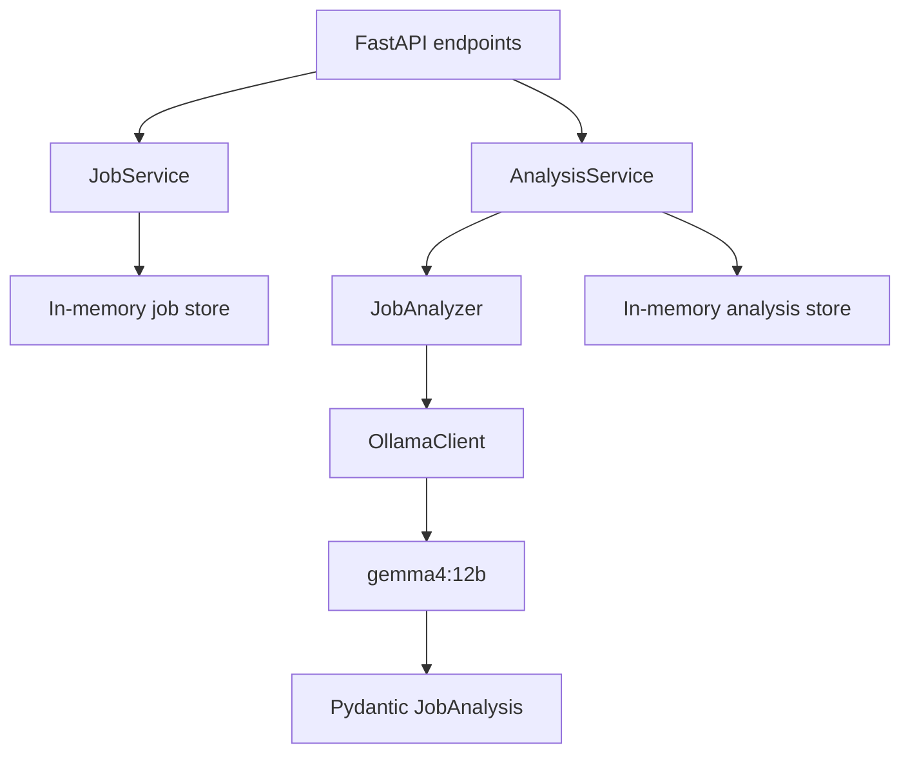

# Job Intelligence

Local AI-powered job analysis and project-proposal system built with FastAPI, Pydantic, Ollama, and Python.

Job Intelligence converts a manually submitted job advertisement into a validated, evidence-backed analysis. The current implementation accepts and stores job facts, sends the job overview to a local `gemma4:12b` model, and returns structured findings such as required skills, preferred skills, technologies, responsibilities, employer pain points, expected deliverables, and seniority.

> Development status: Phases 1–3 of the planned 14-phase roadmap. The application is an early local prototype and is not production-ready.

## Current capabilities

- Run a local FastAPI service with interactive OpenAPI documentation.
- Verify API and Ollama connectivity through diagnostic endpoints.
- Submit job advertisements manually through a validated API request.
- Store and retrieve jobs in memory using server-generated UUIDs.
- Analyze a stored job with the local `gemma4:12b` model.
- Require the model to return JSON matching a Pydantic schema.
- Separate factual job data from AI-generated interpretation.
- Distinguish required skills, preferred skills, and technologies merely mentioned in the advertisement.
- Preserve concise excerpts from the job overview as evidence for important claims.
- Validate domain models with automated tests that do not require a running LLM.

## Project goals

The completed system is intended to:

1. Collect or accept job listings from an authorized source.
2. Preserve the original job facts and source URL.
3. Interpret the employer's needs using a local LLM.
4. Calculate semantic and rule-based relevance against a user's search criteria.
5. Generate a focused proof-of-concept project for a relevant job.
6. Evaluate the proposed project independently.
7. Save job history and generated artifacts.
8. Export a PDF intelligence report containing the source facts, analysis, relevance evidence, and project proposal.

The current release covers only job ingestion and structured job analysis.

## Current architecture



The code separates five responsibilities:

| Layer | Responsibility |
|---|---|
| API | Accept HTTP requests and return HTTP responses. |
| Services | Coordinate job storage and analysis operations. |
| Domain models | Define and validate job facts and AI analysis data. |
| LLM components | Build prompts and communicate with Ollama. |
| Tests | Verify validation and application behavior without relying on a live model. |

## Technology stack

| Component | Purpose |
|---|---|
| Python | Application language |
| FastAPI | HTTP API and OpenAPI documentation |
| Pydantic | Request, response, and structured LLM-output validation |
| Ollama | Local model runtime |
| `gemma4:12b` | Current job-analysis model |
| Pytest | Automated testing |
| Uvicorn | ASGI development server |

## Repository structure

```text
job-intelligence/
├── app/
│   ├── __init__.py
│   ├── main.py
│   ├── api/
│   │   ├── __init__.py
│   │   └── jobs.py
│   ├── llm/
│   │   ├── __init__.py
│   │   ├── client.py
│   │   └── job_analyzer.py
│   ├── models/
│   │   ├── __init__.py
│   │   └── schemas.py
│   └── services/
│       ├── __init__.py
│       ├── analysis_service.py
│       └── job_service.py
├── tests/
│   ├── test_analysis_models.py
│   └── test_jobs.py
├── pytest.ini
├── requirements.txt
└── README.md
```

## Domain model

The application deliberately keeps source facts separate from model interpretation.

### Job facts

`JobCreate` validates user-supplied fields:

- title
- source URL
- company
- type of work
- hours per week
- salary
- date updated
- job overview

`Job` extends those fields with server-controlled metadata:

- UUID
- UTC creation timestamp

### AI interpretation

`JobAnalysis` contains:

- role category and summary
- seniority
- required skills
- preferred skills
- technology stack
- responsibilities
- employer pain points
- underlying business problem
- expected deliverables
- supporting evidence

Each evidence item contains a category, an interpreted claim, and a concise excerpt copied from the submitted job overview. This makes important model conclusions inspectable instead of returning unsupported prose.

## Requirements

- Python 3.10 or later
- A local [Ollama](https://ollama.com/) installation
- The `gemma4:12b` model available in Ollama

The model requires hardware appropriate for its size. Response time depends on available CPU, GPU, and memory resources.

## Installation

Clone the repository and enter the project directory:

```bash
git clone <repository-url>
cd job-intelligence
```

Create and activate a virtual environment:

```bash
python3 -m venv .venv
source .venv/bin/activate
```

On Windows PowerShell:

```powershell
python -m venv .venv
.venv\Scripts\Activate.ps1
```

Install dependencies:

```bash
pip install -r requirements.txt
```

Pull the configured model if it is not already installed:

```bash
ollama pull gemma4:12b
```

Confirm that Ollama is running and that the model responds:

```bash
curl http://localhost:11434/api/generate \
  -d '{
    "model": "gemma4:12b",
    "prompt": "Return only the word READY.",
    "stream": false
  }'
```

## Running the application

From the repository root:

```bash
uvicorn app.main:app --reload
```

Open the interactive API documentation:

```text
http://127.0.0.1:8000/docs
```

The default API base URL is:

```text
http://127.0.0.1:8000
```

## API reference

| Method | Endpoint | Description | LLM required |
|---|---|---|---|
| `GET` | `/health` | Verify that the FastAPI service is running. | No |
| `GET` | `/ollama/test` | Verify application-to-Ollama communication. | Yes |
| `POST` | `/jobs/manual` | Validate and store a manually submitted job. | No |
| `GET` | `/jobs` | List all jobs currently held in memory. | No |
| `GET` | `/jobs/{job_id}` | Retrieve one stored job. | No |
| `POST` | `/jobs/{job_id}/analyze` | Analyze a stored job and cache its analysis in memory. | Yes |
| `GET` | `/jobs/{job_id}/analysis` | Retrieve the latest cached analysis for a job. | No |

### Health check

```bash
curl http://127.0.0.1:8000/health
```

Expected response:

```json
{
  "status": "ok",
  "service": "job-intelligence"
}
```

### Submit a job manually

```bash
curl -X POST http://127.0.0.1:8000/jobs/manual \
  -H "Content-Type: application/json" \
  -d '{
    "title": "Python AI Backend Developer",
    "source_url": "https://example.com/jobs/ai-python",
    "company": "Example AI Company",
    "type_of_work": "full_time",
    "hours_per_week": 40,
    "salary": "$2000-$3000/month",
    "date_updated": "2026-09-17",
    "job_overview": "We are building an AI-powered document processing platform and need a Python developer to help complete our backend MVP. You will develop FastAPI endpoints, integrate local and cloud LLM APIs, improve our document ingestion pipeline, and implement semantic search using vector embeddings. Our current application uses a React frontend and PostgreSQL database. Experience with RAG systems is strongly preferred. The main challenge is improving the reliability of document extraction and producing accurate answers from uploaded documents."
  }'
```

The API returns the validated job with a generated `id` and `created_at` value. Retain the returned UUID for subsequent calls.

### Analyze a job

Replace `<job-id>` with the UUID returned during job creation:

```bash
curl -X POST \
  http://127.0.0.1:8000/jobs/<job-id>/analyze
```

The response follows the `JobAnalysis` schema:

```json
{
  "job_id": "2d42f492-4d2e-42e4-ad0c-3bdcb08a96cc",
  "role_category": "Python AI Backend Developer",
  "role_summary": "Backend development for an AI-powered document platform.",
  "seniority": "unknown",
  "required_skills": [
    "Python",
    "FastAPI",
    "LLM API integration",
    "vector embeddings"
  ],
  "preferred_skills": [
    "RAG systems"
  ],
  "tech_stack": [
    "Python",
    "FastAPI",
    "React",
    "PostgreSQL"
  ],
  "responsibilities": [
    "Develop FastAPI endpoints",
    "Improve the document ingestion pipeline"
  ],
  "employer_pain_points": [
    "Unreliable document extraction",
    "Inaccurate answers from uploaded documents"
  ],
  "business_problem": "Complete and improve an AI-powered document processing platform.",
  "expected_deliverables": [
    "Backend API endpoints",
    "Improved document ingestion",
    "Semantic search capability"
  ],
  "evidence": [
    {
      "category": "pain_point",
      "claim": "Document extraction reliability needs improvement.",
      "source_text": "The main challenge is improving the reliability of document extraction"
    }
  ]
}
```

LLM wording may vary. Schema validity, semantic accuracy, and direct evidence are the required invariants.

### Retrieve an analysis

```bash
curl http://127.0.0.1:8000/jobs/<job-id>/analysis
```

The endpoint returns `404 Not Found` if the job does not exist or has not yet been analyzed.

## Validation behavior

The API rejects malformed job submissions with `422 Unprocessable Entity`. Current examples include:

- a title shorter than two characters
- a job overview shorter than 20 characters
- an invalid work-type value
- hours below `0` or above `168` per week
- malformed date values

Valid work-type values are:

```text
full_time
part_time
freelance
contract
unknown
```

Valid seniority values in an analysis are:

```text
intern
junior
mid
senior
lead
unknown
```

## Structured LLM output

The `OllamaClient.generate_structured()` method supplies the `JobAnalysis` JSON schema to Ollama and validates the returned JSON with Pydantic. Generation uses a temperature of `0` to reduce output variability.

The analyzer prompt enforces these rules:

- Use only information present in the supplied advertisement.
- Do not invent common but unmentioned skills or technologies.
- Separate required skills from preferred or optional skills.
- Separate the existing technology stack from applicant requirements.
- Return `unknown` when seniority is not supported by the source.
- Return `null` when the business problem is unclear.
- Copy evidence excerpts directly from the job overview.

Structured output constrains format; it does not guarantee factual accuracy. Model results still require evaluation against labeled examples.

## Testing

Run all tests from the repository root:

```bash
python -m pytest -v
```

The included `pytest.ini` allows plain `pytest -v` to resolve the local `app` package:

```ini
[pytest]
pythonpath = .
testpaths = tests
```

Current tests cover:

- successful manual job creation
- invalid working-hour rejection
- valid `JobAnalysis` construction
- invalid seniority rejection

Normal unit tests do not call Ollama. This keeps the test suite deterministic and independent of model availability, hardware, and generation variability. Live Ollama tests will be introduced separately as integration tests.

## Design decisions

### Facts and interpretations are separate

`Job` represents source data. `JobAnalysis` represents a model's interpretation. Keeping them separate prevents inferred content from being mistaken for original employer-provided information.

### LLM access is isolated

Application modules do not call `ollama.chat()` directly. All model communication passes through `OllamaClient`, allowing model selection, host configuration, error handling, observability, and testing to evolve without coupling those changes to the API.

### Storage is abstracted behind services

The API depends on `JobService` and `AnalysisService`, not directly on dictionaries. A later phase can replace in-memory storage with SQLite or PostgreSQL while keeping most endpoint behavior stable.

### Relevance will not be an arbitrary LLM score

Future relevance scoring will combine semantic similarity with explicit rules and evidence. The LLM may interpret the advertisement, but it will not be trusted to invent an unsupported numerical score.

## Current limitations

- Jobs and analyses are stored only in process memory.
- Restarting the application deletes all current records.
- There is no authentication, authorization, or multi-user isolation.
- There is no database or migration system.
- There is no automated job collection or HTML parsing.
- There is no semantic relevance score yet.
- There is no POC generator or independent POC evaluator yet.
- There is no PDF report generation.
- There are no retries, timeouts, or application-level exception mappings for model failures.
- There is no integration-test suite for live Ollama calls.
- There is no labeled evaluation dataset for measuring analysis quality.
- Synchronous model inference can block a request until generation finishes.

Do not deploy the current version as an internet-facing production service.

## Development roadmap

| Phase | Scope | Status |
|---:|---|---|
| 1 | FastAPI foundation and Ollama connectivity | Implemented |
| 2 | Job models and manual job ingestion | Implemented |
| 3 | Structured, evidence-backed LLM job analysis | Implemented |
| 4 | Embeddings and semantic relevance scoring | Next |
| 5 | Hybrid relevance engine | Planned |
| 6 | POC/mini-project generator | Planned |
| 7 | Independent POC relevance evaluator | Planned |
| 8 | SQLite persistence and job history | Planned |
| 9 | Job-source abstraction and HTML parsing | Planned |
| 10 | Authorized job listing collection/search integration | Planned |
| 11 | PDF intelligence report generation | Planned |
| 12 | Evaluation dataset, testing, and accuracy tuning | Planned |
| 13 | Controlled agentic revision workflow | Planned |
| 14 | Final cleanup, CLI/API workflow, and portfolio release | Planned |

Phase 4 will introduce embeddings and a mathematically calculated semantic relevance score between user search intent and the analyzed job. It will not add scraping, persistence, or autonomous agents.

## Responsible use

Any future job-source integration must comply with the source site's terms, access controls, rate limits, robots directives where applicable, and applicable law. The source interface will be designed so saved HTML fixtures or explicitly authorized providers can be used without coupling the intelligence pipeline to a particular website.

Job analyses are decision-support outputs. They can omit details, misclassify requirements, or produce unsupported interpretations despite schema validation. Preserve source text, inspect evidence, and evaluate the model against manually labeled job descriptions before relying on its output.

## Version history

### `0.3.0`

- Added structured `JobAnalysis` models.
- Added evidence categories and source-text evidence.
- Added `OllamaClient.generate_structured()`.
- Added the Gemma-based `JobAnalyzer`.
- Added job analysis creation and retrieval endpoints.
- Added schema-validation tests.

### `0.2.0`

- Added validated job domain models.
- Added manual job ingestion and retrieval endpoints.
- Added in-memory job storage.
- Added initial API tests.

### `0.1.0`

- Added FastAPI application foundation.
- Added health and Ollama connectivity endpoints.
- Isolated Ollama access behind `OllamaClient`.
