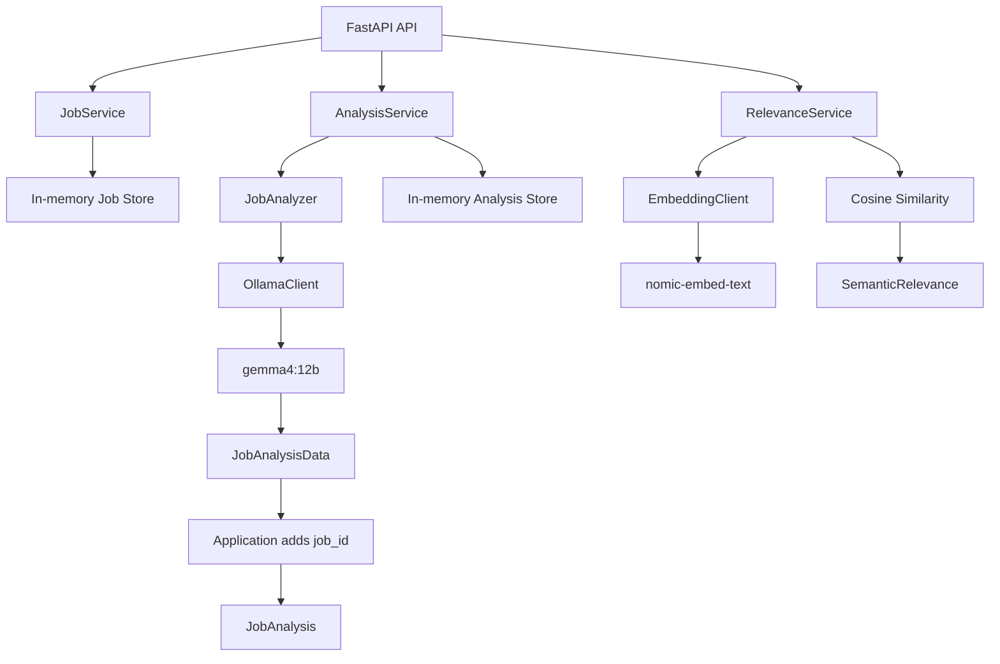

# Job Intelligence

Local AI-powered job analysis, semantic relevance, and portfolio-project intelligence system built with Python, FastAPI, Pydantic, Ollama, and local embedding models.

Job Intelligence accepts a job advertisement, preserves its factual fields, interprets the job overview with a local LLM, and calculates a deterministic semantic relevance score against a user's search intent. The longer-term goal is to identify relevant jobs, understand the employer's actual technical and business needs, generate a focused proof-of-concept project for each strong match, independently evaluate that POC, and export the result as a job intelligence report.

> Development status: **Phases 1–4 implemented** from the planned 14-phase roadmap. The application is still a local prototype and is not production-ready.

---

## Current capabilities

- Run a local FastAPI service with interactive OpenAPI documentation.
- Verify FastAPI and Ollama connectivity through diagnostic endpoints.
- Submit job advertisements manually through a validated API request.
- Store and retrieve jobs in memory using server-generated UUIDs.
- Analyze stored job advertisements using the local `gemma4:12b` model.
- Require AI analysis to conform to a Pydantic-defined structured output schema.
- Keep application-owned fields such as `job_id` outside LLM generation.
- Reject empty or malformed structured Ollama responses before Pydantic parsing.
- Separate source job facts from AI-generated interpretation.
- Distinguish required skills, preferred skills, and technologies merely mentioned in the advertisement.
- Extract role summary, seniority, responsibilities, employer pain points, business problem, expected deliverables, and evidence.
- Preserve concise source excerpts as evidence for important AI interpretations.
- Generate local embeddings with `nomic-embed-text`.
- Build a normalized semantic representation of an analyzed job.
- Calculate cosine similarity between a user's search query and a job representation in Python.
- Return a transparent semantic relevance score without allowing the LLM to invent the number.
- Test deterministic application behavior without requiring live Ollama inference during normal unit tests.

---

## Project goals

The completed system is intended to:

1. Accept a user's search intent such as `Python Developer`.
2. Collect or accept job listings from an authorized source.
3. Preserve original job facts and source URLs.
4. Interpret employer requirements and pain points using a local LLM.
5. Calculate semantic and rule-based relevance against the user's search criteria.
6. Rank jobs using an explainable hybrid relevance score.
7. Generate a focused proof-of-concept or mini project for strong job matches.
8. Evaluate the generated POC independently against the original job requirements.
9. Store job history, analyses, scores, and generated project proposals.
10. Export a PDF intelligence report containing source facts, analysis, relevance evidence, POC proposal, and POC evaluation.

The current release implements job ingestion, structured job analysis, embeddings, and semantic relevance scoring.

---

# Architecture

## Current pipeline



The code currently separates these responsibilities:

| Layer | Responsibility |
|---|---|
| API | Accept HTTP requests and return HTTP responses. |
| Services | Coordinate storage, analysis, and semantic relevance operations. |
| Domain models | Validate job facts, AI analysis, and relevance results. |
| LLM components | Build prompts and communicate with generative Ollama models. |
| Embedding components | Generate vector representations using a dedicated embedding model. |
| Scoring components | Perform deterministic mathematical relevance calculations. |
| Tests | Validate deterministic behavior independently from live LLM inference. |

---

# Technology stack

| Component | Purpose |
|---|---|
| Python | Main application language |
| FastAPI | HTTP API and OpenAPI documentation |
| Pydantic | Input validation and structured AI-output validation |
| Ollama | Local model runtime |
| `gemma4:12b` | Job interpretation model |
| `nomic-embed-text` | Semantic embedding model |
| NumPy | Cosine similarity calculations |
| Pytest | Automated tests |
| Uvicorn | ASGI development server |

Planned later in the roadmap:

| Component | Planned purpose |
|---|---|
| `qwen3:8b` | Independent POC evaluator |
| SQLite | Persistent local storage |
| ReportLab | PDF intelligence report generation |
| BeautifulSoup / HTTP client | Authorized HTML parsing and job-source integration |

---

# Repository structure

```text
job-intelligence/
├── app/
│   ├── __init__.py
│   ├── main.py
│   │
│   ├── api/
│   │   ├── __init__.py
│   │   └── jobs.py
│   │
│   ├── embeddings/
│   │   ├── __init__.py
│   │   └── client.py
│   │
│   ├── llm/
│   │   ├── __init__.py
│   │   ├── client.py
│   │   └── job_analyzer.py
│   │
│   ├── models/
│   │   ├── __init__.py
│   │   └── schemas.py
│   │
│   ├── scoring/
│   │   ├── __init__.py
│   │   └── semantic_relevance.py
│   │
│   └── services/
│       ├── __init__.py
│       ├── analysis_service.py
│       ├── job_service.py
│       └── relevance_service.py
│
├── tests/
│   ├── test_analysis_models.py
│   ├── test_jobs.py
│   └── test_semantic_relevance.py
│
├── pytest.ini
├── requirements.txt
└── README.md
```

---

# Domain model

The application deliberately separates **facts**, **AI interpretations**, and **calculated scores**.

## Job facts

`JobCreate` validates user-supplied source fields:

- `title`
- `source_url`
- `company`
- `type_of_work`
- `hours_per_week`
- `salary`
- `date_updated`
- `job_overview`

`Job` extends those source fields with application-controlled metadata:

- `id`
- `created_at`

The API owns these values. The user and LLM do not generate them.

## AI analysis

The structured analysis includes:

- role category
- role summary
- seniority
- required skills
- preferred skills
- technology stack
- responsibilities
- employer pain points
- business problem
- expected deliverables
- supporting evidence

### `JobAnalysisData`

`JobAnalysisData` contains only fields the LLM is responsible for generating.

Conceptually:

```python
class JobAnalysisData(BaseModel):
    role_category: str
    role_summary: str
    seniority: SeniorityLevel = SeniorityLevel.UNKNOWN
    required_skills: list[str] = Field(default_factory=list)
    preferred_skills: list[str] = Field(default_factory=list)
    tech_stack: list[str] = Field(default_factory=list)
    responsibilities: list[str] = Field(default_factory=list)
    employer_pain_points: list[str] = Field(default_factory=list)
    business_problem: str | None = None
    expected_deliverables: list[str] = Field(default_factory=list)
    evidence: list[AnalysisEvidence] = Field(default_factory=list)

class JobAnalysis(JobAnalysisData):
    job_id: UUID
```

This prevents the model from fabricating or incorrectly reproducing application-owned identifiers.

The pipeline is:

```text
Job
 │
 ├── job.id stays in Python
 │
 ▼
Job overview
 │
 ▼
gemma4:12b
 │
 ▼
JobAnalysisData
 │
 ├── Python adds job.id
 │
 ▼
JobAnalysis
```

## Evidence model

Each important interpretation can include:

- evidence category
- interpreted claim
- concise source-text excerpt

This makes analysis inspectable instead of returning unsupported prose.

## Semantic relevance

`SemanticRelevance` contains:

- `job_id`
- `query`
- `embedding_model`
- `cosine_similarity`
- `semantic_score`

Example:

```json
{
  "job_id": "4a52ec1e-ff55-486c-98c6-7180560ac1aa",
  "query": "Python FastAPI backend developer",
  "embedding_model": "nomic-embed-text:latest",
  "cosine_similarity": 0.812734,
  "semantic_score": 81.27
}
```

`semantic_score` is a presentation of embedding similarity. It is **not** an 81.27% probability that the job is suitable.

---

# Requirements

- Python 3.10 or later
- Ollama installed locally
- `gemma4:12b`
- `nomic-embed-text`

Verify installed models:

```bash
ollama list
```

Required models for the current phase:

```bash
ollama pull gemma4:12b
ollama pull nomic-embed-text
```

Model performance depends on available CPU, GPU, memory, and model-loading overhead.

---

# Installation

Clone the repository:

```bash
git clone <repository-url>
cd job-intelligence
```

Create a virtual environment:

```bash
python3 -m venv .venv
source .venv/bin/activate
```

Windows PowerShell:

```powershell
python -m venv .venv
.venv\Scripts\Activate.ps1
```

Install dependencies:

```bash
pip install -r requirements.txt
```

A current minimal dependency file should include:

```text
fastapi
uvicorn[standard]
ollama
pydantic
pytest
numpy
```

---

# Running the application

Start the development server from the repository root:

```bash
uvicorn app.main:app --reload
```

Open the interactive FastAPI documentation:

```text
http://127.0.0.1:8000/docs
```

Default API base URL:

```text
http://127.0.0.1:8000
```

---

# API reference

| Method | Endpoint | Description | Ollama required |
|---|---|---|---|
| `GET` | `/health` | Verify that FastAPI is running. | No |
| `GET` | `/ollama/test` | Verify generative-model connectivity. | Yes |
| `POST` | `/jobs/manual` | Validate and store a manually supplied job. | No |
| `GET` | `/jobs` | List currently stored jobs. | No |
| `GET` | `/jobs/{job_id}` | Retrieve one job. | No |
| `POST` | `/jobs/{job_id}/analyze` | Analyze a stored job with `gemma4:12b`. | Yes |
| `GET` | `/jobs/{job_id}/analysis` | Retrieve the cached structured analysis. | No |
| `POST` | `/jobs/{job_id}/semantic-relevance` | Calculate query-to-job semantic relevance. | Yes, embedding model |

---

# API usage

## Health check

```bash
curl http://127.0.0.1:8000/health
```

Expected response:

```json
{
  "status": "ok",
  "service": "job-intelligence"
}
```

## Submit a job manually

```bash
curl -X POST http://127.0.0.1:8000/jobs/manual \
  -H "Content-Type: application/json" \
  -d '{
    "title": "Python AI Backend Developer",
    "source_url": "https://example.com/jobs/ai-python",
    "company": "Example AI Company",
    "type_of_work": "full_time",
    "hours_per_week": 40,
    "salary": "$2000-$3000/month",
    "date_updated": "2026-09-17",
    "job_overview": "We are building an AI-powered document processing platform and need a Python developer to help complete our backend MVP. You will develop FastAPI endpoints, integrate local and cloud LLM APIs, improve our document ingestion pipeline, and implement semantic search using vector embeddings. Our current application uses a React frontend and PostgreSQL database. Experience with RAG systems is strongly preferred. The main challenge is improving the reliability of document extraction and producing accurate answers from uploaded documents."
  }'
```

The API returns the validated job plus server-generated `id` and `created_at` fields.

Retain the returned UUID for subsequent calls.

## Analyze a stored job

```bash
curl -X POST http://127.0.0.1:8000/jobs/<job-id>/analyze
```

A representative response:

```json
{
  "job_id": "2d42f492-4d2e-42e4-ad0c-3bdcb08a96cc",
  "role_category": "Python AI Backend Developer",
  "role_summary": "Backend development for an AI-powered document platform.",
  "seniority": "unknown",
  "required_skills": [
    "Python",
    "FastAPI",
    "LLM API integration",
    "vector embeddings"
  ],
  "preferred_skills": [
    "RAG systems"
  ],
  "tech_stack": [
    "Python",
    "FastAPI",
    "React",
    "PostgreSQL"
  ],
  "responsibilities": [
    "Develop FastAPI endpoints",
    "Improve the document ingestion pipeline"
  ],
  "employer_pain_points": [
    "Unreliable document extraction",
    "Inaccurate answers from uploaded documents"
  ],
  "business_problem": "Complete and improve an AI-powered document processing platform.",
  "expected_deliverables": [
    "Backend API endpoints",
    "Improved document ingestion",
    "Semantic search capability"
  ],
  "evidence": [
    {
      "category": "pain_point",
      "claim": "Document extraction reliability needs improvement.",
      "source_text": "The main challenge is improving the reliability of document extraction"
    }
  ]
}
```

LLM wording may vary. Required invariants are:

- valid schema
- correct relationship to the supplied source
- clear separation between required and preferred skills
- no unsupported technical requirements
- evidence grounded in the job overview

## Retrieve analysis

```bash
curl http://127.0.0.1:8000/jobs/<job-id>/analysis
```

## Calculate semantic relevance

A job must be analyzed first.

```bash
curl -X POST http://127.0.0.1:8000/jobs/<job-id>/semantic-relevance \
  -H "Content-Type: application/json" \
  -d '{
    "query": "Python FastAPI backend developer"
  }'
```

Representative response:

```json
{
  "job_id": "2d42f492-4d2e-42e4-ad0c-3bdcb08a96cc",
  "query": "Python FastAPI backend developer",
  "embedding_model": "nomic-embed-text:latest",
  "cosine_similarity": 0.812734,
  "semantic_score": 81.27
}
```

The exact score will vary with input wording and the embedding model version.

---

# Structured LLM output

## Why structured output is required

Free-form LLM prose is difficult to validate and difficult to consume reliably in later pipeline stages.

The application therefore requires the model to produce JSON matching a Pydantic schema.

The client conceptually performs:

```python
response = self.client.chat(
    model=self.model,
    messages=messages,
    format=schema.model_json_schema(),
    options={"temperature": 0},
    think=False,
)
```

Then validates the returned content:

```python
return schema.model_validate_json(content)
```

## Empty-response handling

An earlier failure produced:

```text
ValidationError: Invalid JSON: EOF while parsing a value
```

The actual problem was that Pydantic received an empty string from the Ollama response.

The client now validates content before passing it to Pydantic:

```python
content = (response.message.content or "").strip()

if not content:
    raise OllamaStructuredOutputError(
        f"Model {self.model} returned empty structured output."
    )
```

This keeps transport/model failures distinct from schema-validation failures.

## Prompt constraints

The analyzer instructs the LLM to:

- use only information supplied in the job advertisement
- not invent technologies or qualifications
- distinguish required skills from preferred skills
- distinguish existing technologies from candidate requirements
- return `unknown` when seniority cannot be determined
- return `null` when a business problem is not sufficiently supported
- copy evidence snippets from the supplied job overview

Structured output constrains format. It does not by itself guarantee factual accuracy.

---

# Semantic relevance

Phase 4 adds mathematical semantic comparison between user intent and an analyzed job.

## Embedding flow

```text
User query
    │
    ▼
nomic-embed-text
    │
    ├───────────────┐
    │               │
    ▼               ▼
Query vector     Job vector
                     ▲
                     │
             Normalized job text
                     ▲
                     │
                 JobAnalysis
    │
    └────────┬──────┘
             ▼
      Cosine similarity
             │
             ▼
      Semantic relevance
```

## Normalized job document

Semantic comparison does not rely only on the title and does not blindly embed an entire webpage.

`RelevanceService` constructs a focused representation from fields such as:

- job title
- role category
- role summary
- required skills
- preferred skills
- technology stack
- responsibilities
- business problem

This reduces irrelevant marketing text and emphasizes the meaning of the role.

## Cosine similarity

The score is calculated in Python rather than generated by an LLM.

Conceptually:

```python
def cosine_similarity(vector_a: list[float], vector_b: list[float]) -> float:
    a = np.asarray(vector_a, dtype=np.float64)
    b = np.asarray(vector_b, dtype=np.float64)

    if a.shape != b.shape:
        raise ValueError("Embedding vectors must have the same dimensions.")

    norm_a = np.linalg.norm(a)
    norm_b = np.linalg.norm(b)

    if norm_a == 0 or norm_b == 0:
        raise ValueError("Embedding vectors cannot have zero magnitude.")

    similarity = np.dot(a, b) / (norm_a * norm_b)
    return float(np.clip(similarity, -1.0, 1.0))
```

The presentation score currently maps positive similarity into a `0–100` range:

```python
def similarity_to_score(similarity: float) -> float:
    bounded = max(0.0, min(1.0, similarity))
    return round(bounded * 100, 2)
```

This number is intentionally **not yet treated as final job relevance**.

---

# Validation behavior

The API rejects malformed jobs with `422 Unprocessable Entity`.

Examples include:

- title shorter than two characters
- job overview shorter than 20 characters
- invalid work-type value
- working hours below `0`
- working hours above `168`
- malformed date values

Valid work types:

```text
full_time
part_time
freelance
contract
unknown
```

Valid seniority levels:

```text
intern
junior
mid
senior
lead
unknown
```

Attempting semantic relevance before analysis returns an application conflict response because the normalized `JobAnalysis` does not yet exist.

---

# Testing

Run tests from the repository root:

```bash
python -m pytest -v
```

The project includes:

```ini
[pytest]
pythonpath = .
testpaths = tests
```

This allows:

```bash
pytest -v
```

without `ModuleNotFoundError: No module named 'app'` when run from the repository root.

## Current test coverage

Current unit tests cover:

- successful manual job creation
- invalid working-hour rejection
- valid `JobAnalysis` construction
- invalid seniority rejection
- cosine similarity for identical vectors
- cosine similarity for orthogonal vectors
- cosine similarity for opposite vectors
- vector-dimension mismatch handling
- conversion of similarity to presentation score
- negative-similarity handling
- relevance service behavior with a fake embedding client

## Why normal unit tests do not call Ollama

Live model calls introduce external runtime dependencies:

- Ollama process availability
- installed model availability
- model loading time
- CPU/GPU differences
- generation variability

Normal unit tests therefore use deterministic dependencies where possible.

Example concept:

```text
Production
    ↓
EmbeddingClient
    ↓
Ollama

Tests
    ↓
FakeEmbeddingClient
    ↓
Deterministic vectors
```

Live Ollama behavior should eventually be covered by a separate integration-test suite.

---

# Design decisions

## 1. Facts and interpretations remain separate

`Job` represents source facts.

`JobAnalysis` represents AI interpretation.

`SemanticRelevance` represents a calculated comparison.

This prevents model-produced information from being mistaken for employer-provided facts.

## 2. Application-owned identifiers are not generated by the LLM

The model generates `JobAnalysisData` only.

Python attaches the existing `job.id` when constructing `JobAnalysis`.

This prevents hallucinated or malformed identifiers.

## 3. LLM communication is isolated

Application modules do not call Ollama throughout the codebase.

Generative inference goes through `OllamaClient`.

This allows model selection, host configuration, error handling, logging, retries, and testing to evolve independently.

## 4. Embedding communication is isolated

Embeddings use a separate `EmbeddingClient`.

This keeps generative reasoning and vector generation as distinct concerns.

## 5. Semantic scores are deterministic

The LLM does not produce the semantic score.

The embedding model produces vectors; Python performs the mathematical comparison.

## 6. Semantic relevance is not final relevance

A high semantic score does not prove that all user requirements are satisfied.

For example, two jobs may both be strongly related to Python while differing in:

- employment type
- working hours
- required frameworks
- seniority
- required experience
- compensation
- location

Phase 5 will address this with hybrid scoring.

## 7. Storage remains abstracted behind services

Current dictionaries are temporary implementation details.

The API interacts with `JobService` and `AnalysisService`, allowing a later SQLite implementation without redesigning the entire HTTP layer.

## 8. Agent frameworks are intentionally deferred

The current pipeline is an explicit workflow rather than an autonomous multi-agent system.

Agentic revision will only be introduced after deterministic extraction, scoring, POC generation, and evaluation work reliably.

---

# Current limitations

- Jobs are stored only in process memory.
- Analyses are stored only in process memory.
- Restarting FastAPI deletes current records.
- Semantic scores are not persisted.
- No authentication or authorization exists.
- No database or migration system exists.
- No automated job-source integration exists yet.
- No HTML parser exists yet.
- Semantic similarity is only one component of relevance.
- No calibrated relevance thresholds exist yet.
- No hybrid job relevance score exists yet.
- No POC generator exists yet.
- No independent POC evaluator exists yet.
- No PDF report generator exists yet.
- No labeled evaluation dataset exists yet.
- No complete live-Ollama integration-test suite exists yet.
- Synchronous model inference can block HTTP requests.
- Model retries and timeout policies are not yet production-grade.

Do not deploy the current version as an internet-facing production service.

---

# Development roadmap

| Phase | Scope | Status |
|---:|---|---|
| 1 | FastAPI foundation and Ollama connectivity | **Implemented** |
| 2 | Job models and manual job ingestion | **Implemented** |
| 3 | Structured, evidence-backed LLM job analysis | **Implemented** |
| 4 | Embeddings and semantic relevance scoring | **Implemented** |
| 5 | Hybrid relevance engine | Next |
| 6 | POC / mini-project generator | Planned |
| 7 | Independent POC relevance evaluator | Planned |
| 8 | SQLite persistence and job history | Planned |
| 9 | Job-source abstraction and HTML parsing | Planned |
| 10 | Authorized job listing collection/search integration | Planned |
| 11 | PDF intelligence report generation | Planned |
| 12 | Evaluation dataset, testing, and accuracy tuning | Planned |
| 13 | Controlled agentic revision workflow | Planned |
| 14 | Final cleanup, CLI/API workflow, and portfolio release | Planned |

## Next phase

Phase 5 will combine multiple signals instead of treating semantic similarity as the entire answer.

Planned inputs include:

```text
Semantic similarity
        │
        ├── Required-skill match
        ├── Role/title match
        ├── Search constraints
        └── Constrained LLM classification
        │
        ▼
Hybrid relevance score
```

The score will retain its component values so a user can inspect why one job ranked above another.

---

# Planned final workflow

```text
User search
    │
    ▼
Authorized JobSource
    │
    ▼
Parser
    │
    ▼
Job
    │
    ├───────────────┐
    ▼               ▼
Embeddings      Job Analyzer
    │               │
    └───────┬───────┘
            ▼
    Hybrid Relevance
            │
       strong match
            │
            ▼
       POC Generator
        gemma4:12b
            │
            ▼
       POC Evaluator
          qwen3:8b
            │
            ▼
       PDF Report
```

---

# Responsible use

Any future external job-source integration must comply with the source site's terms, access controls, rate limits, robots directives where applicable, and applicable law.

The application is intentionally being designed around a `JobSource` abstraction so that manually supplied jobs, saved HTML fixtures, or explicitly authorized providers can be used without coupling the intelligence pipeline to a single website.

AI-generated job analyses are decision-support outputs. They may omit information, misclassify a requirement, or make an unsupported inference despite schema validation. Important conclusions should remain traceable to the source advertisement, and model quality should eventually be measured against manually labeled examples.

---

# Version history

## `0.4.0`

- Added `EmbeddingClient` using `nomic-embed-text`.
- Added normalized analyzed-job document construction.
- Added deterministic cosine similarity calculation.
- Added `SemanticRelevanceRequest` and `SemanticRelevance` models.
- Added `RelevanceService`.
- Added `POST /jobs/{job_id}/semantic-relevance`.
- Added deterministic semantic-relevance unit tests.
- Added fake embedding-client testing pattern.
- Clarified that semantic score is not a probability or final relevance score.
- Updated architecture and repository structure for Phase 4.

## `0.3.1`

- Split LLM-generated `JobAnalysisData` from application-controlled `JobAnalysis.job_id`.
- Added explicit empty-response handling before Pydantic JSON validation.
- Added `OllamaStructuredOutputError` for clearer structured-generation failures.
- Added schema guidance directly to structured prompts.
- Disabled model thinking for structured analysis requests where supported.

## `0.3.0`

- Added structured `JobAnalysis` models.
- Added evidence categories and source-text evidence.
- Added `OllamaClient.generate_structured()`.
- Added Gemma-based `JobAnalyzer`.
- Added analysis creation and retrieval endpoints.
- Added schema-validation tests.

## `0.2.0`

- Added validated job domain models.
- Added manual job ingestion and retrieval endpoints.
- Added in-memory job storage.
- Added initial API tests.

## `0.1.0`

- Added FastAPI application foundation.
- Added health and Ollama connectivity endpoints.
- Isolated Ollama communication behind `OllamaClient`.
